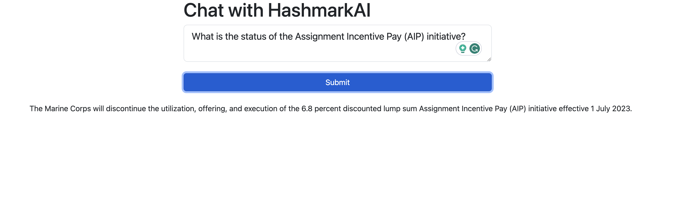

# Alfa
LangChain + ChatGPT on MARADMINS

This project will grow. Right now it is testing various frameworks to train chatbots using LangChain and OpeanAI.

In this example, I store the first page of MARADMINS linked here: https://www.marines.mil/News/Messages/MARADMINS/Customstatus/4000/?Page=1

Then ask the bot a specific question regarding https://www.marines.mil/News/Messages/Messages-Display/Article/3457056/discontinue-the-utilization-of-the-discounted-lump-sum-assignment-incentive-pay/ 
